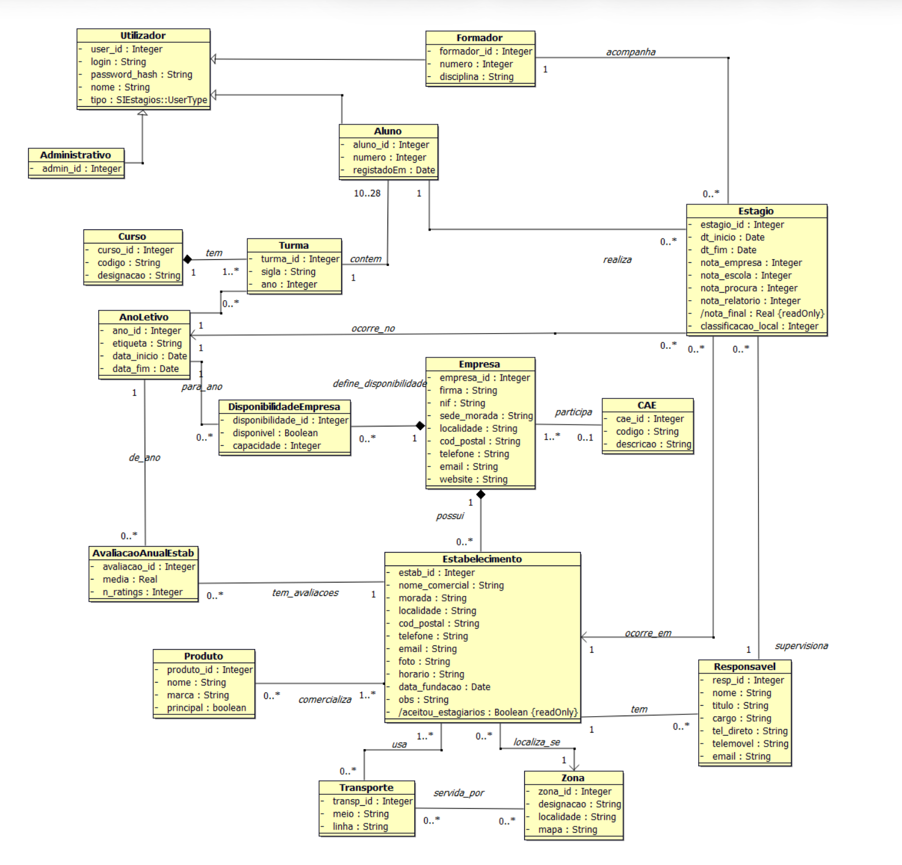
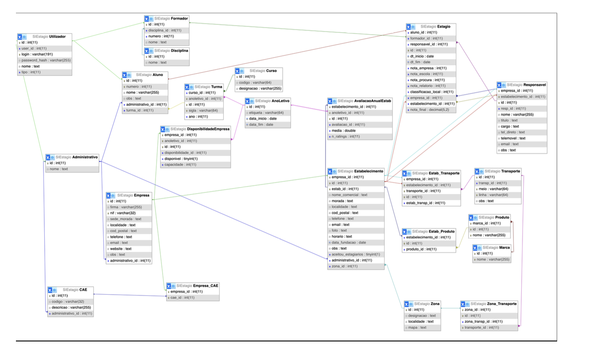

# SIESTÁGIOS

A database project we built for the Databases course at ISCTE-IUL. The idea was to model a real internship management system for a vocational school, handling everything from registering companies and students to tracking internships and calculating final grades.

## Database Design

### UML Diagram


### Relational Model


## Built With

- MySQL / MariaDB
- PHP
- Apache (XAMPP)
- phpMyAdmin

## What it does

The system covers the full internship lifecycle. Companies and their establishments get registered with all their contact and availability info. Students are assigned to classes, matched with companies and supervised by trainers throughout the internship. At the end, trainers submit grades and the system calculates the final weighted result automatically.

## The interesting SQL parts

We went beyond basic queries and used some more advanced database features:

**Stored Procedures**: `P1` handles registering a new internship, but first validates that the student, establishment and trainer all exist before doing anything. `P2` pulls a list of upcoming internships within however many days you pass in.

**Stored Functions**: `F1` calculates the average rating for an establishment in a given academic year. `F2` calculates a student's final grade using configurable weights for each grade component — so you can adjust how much each part counts.

**Triggers**: enforce rules directly in the database, like preventing a class from dropping below a minimum number of students.

## The web interface

Three portals, each for a different user type:

**Administrator**: registers students and internships, manages the active internship list

**Student**: browses companies that have spots available, can filter by location

**Trainer**: submits the four grade components for each internship, final grade is calculated automatically

## Project Structure

```
sistema_php/
├── index.php               # Main menu
├── admin_registar.php      # Administrator portal
├── aluno.php               # Student portal
├── formador.php            # Trainer portal
├── db.php                  # Database connection
└── style.php               # Shared styles
sql/
├── siestagio.sql           # Full database — schema, procedures, functions, triggers and sample data
├── schema_v1.sql           # Initial schema from the UML-to-relational mapping phase
└── initial_export.sql      # Early export from development
assets/
├── uml_diagram.png
└── relational_model.png
```

## How to run it

You'll need XAMPP or any Apache + MySQL setup.

1. Clone the repo
2. In phpMyAdmin, create a database called `siestagio` and import `sql/siestagio.sql` — that one file sets up everything including sample data
3. Drop the `sistema_php/` folder into your XAMPP `htdocs`
4. Open `http://localhost/sistema_php/` in your browser

The default connection in `db.php` uses `root` with no password which is standard for XAMPP locally. Change it if your setup is different.

## The team

Built by four students for the Databases course at ISCTE-IUL, Lisbon.

- Francisco Monteiro Nº 110331
- David Galvão Nº 122602
- Miguel Pancada Nº 122650
- Miguel Serafim Nº 129781
